# Model Evaluation Results

Generated automatically by `evaluations/run_evaluation.py`

---

## 1. MAE Pretrain Evaluation

### 1a. Per-Feature Reconstruction Error

| Feature | MSE (normalized) | Observed Samples |
|---------|-----------------|------------------|
| Li_gL | 0.801330 | 946 |
| Mg_gL | 0.914963 | 946 |
| Na_gL | 0.763745 | 939 |
| K_gL | 0.891867 | 938 |
| Ca_gL | 0.976304 | 937 |
| SO4_gL | 0.910154 | 889 |
| Cl_gL | 0.726605 | 899 |
| MLR | 1.105677 | 946 |
| TDS_gL | 0.661449 | 656 |
| Light_kW_m2 | 1.216247 | 937 |

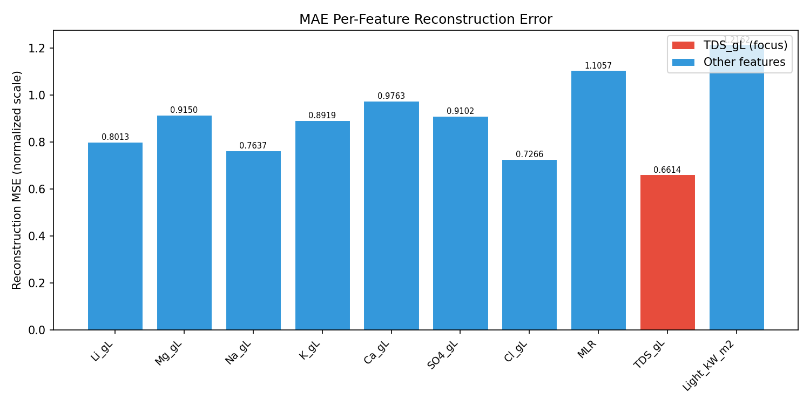

**True vs Predicted scatter plots** (per feature):

Li_gL

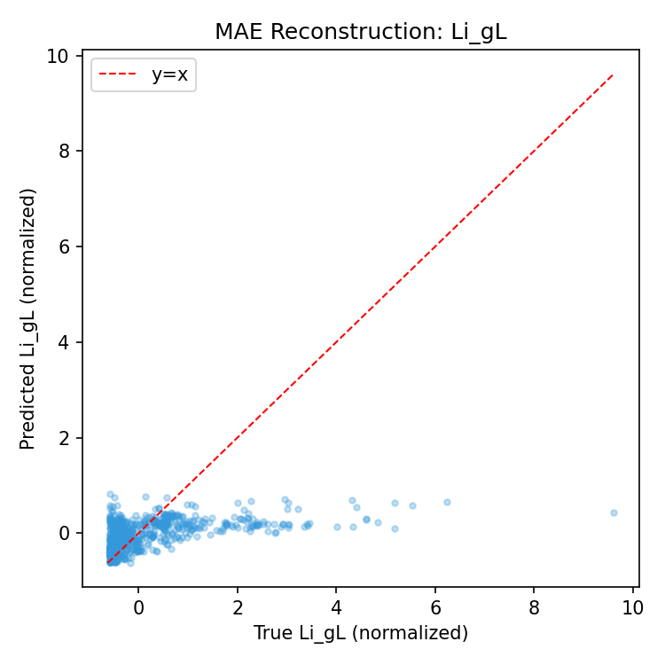

Mg_gL

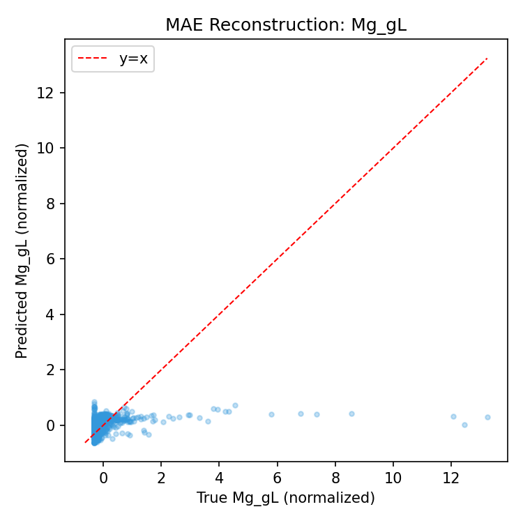

Na_gL

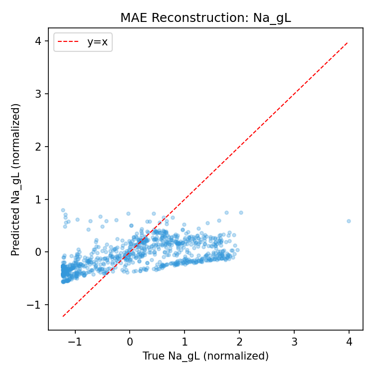

K_gL

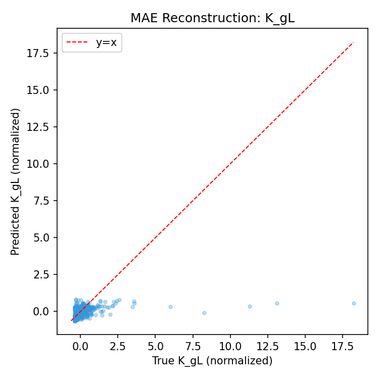

Ca_gL

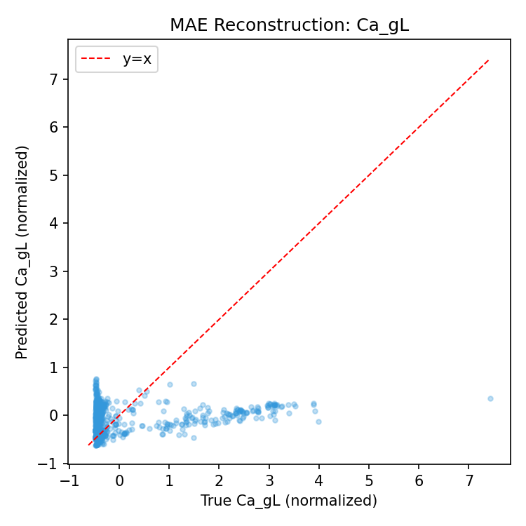

SO4_gL

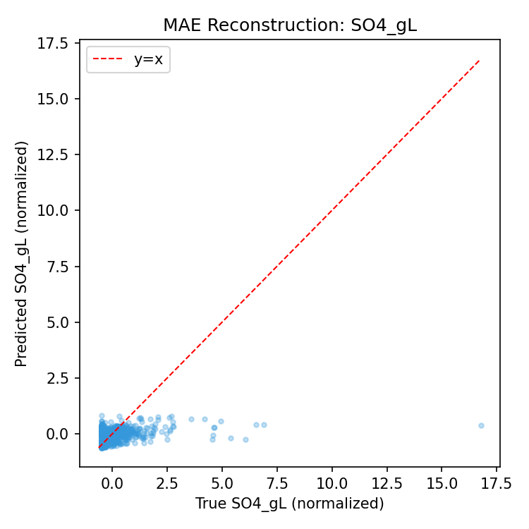

Cl_gL

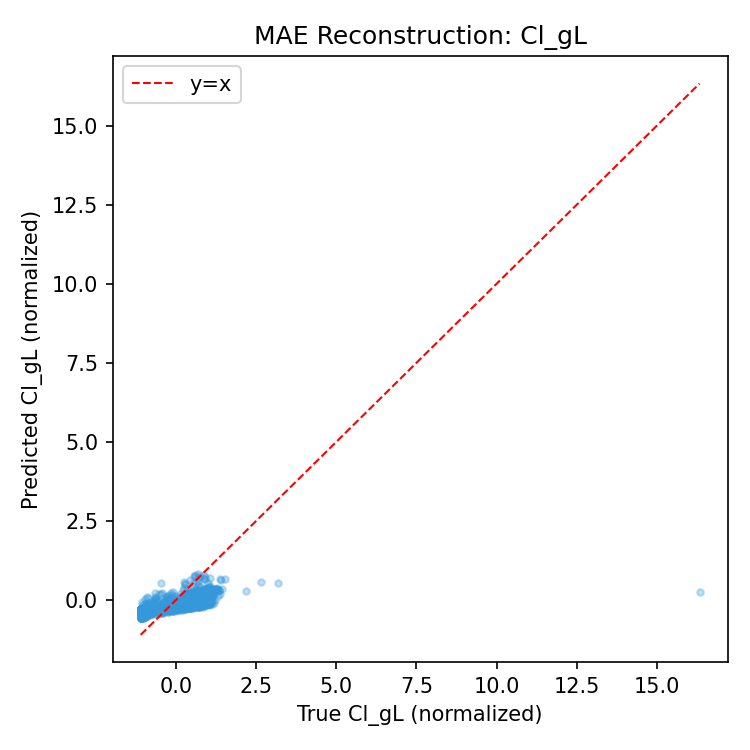

MLR

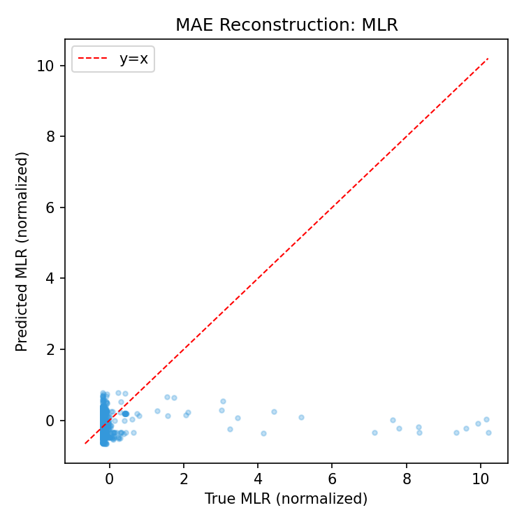

TDS_gL

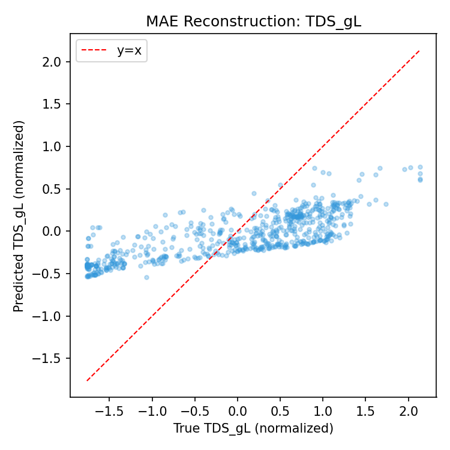

Light_kW_m2

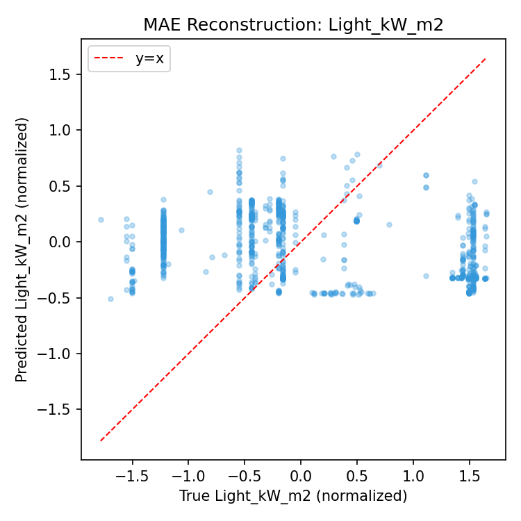

### 1b. Validation Loss Curve

- Final train loss: **0.121608**

- Final val loss: **0.088185**

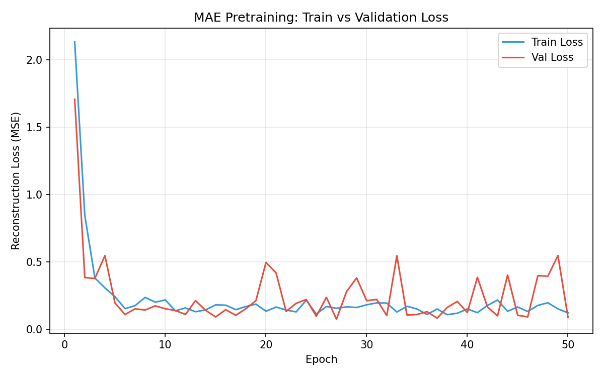

### 1c. Latent Space Visualization (t-SNE)

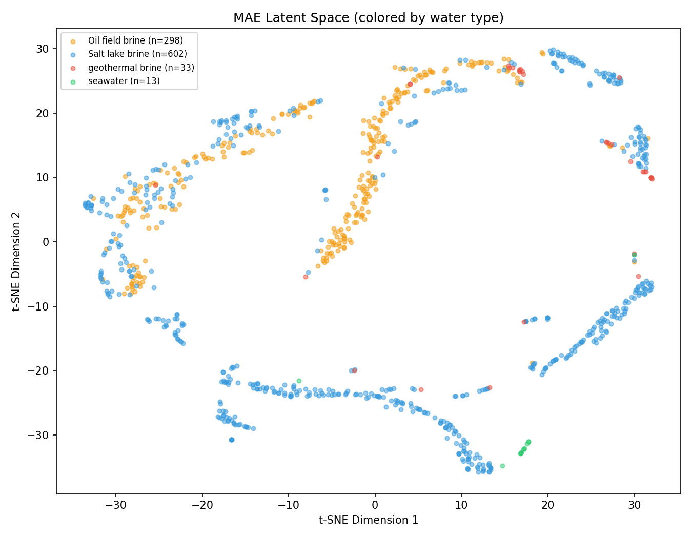

---

## 2. Regression Fine-tuning Evaluation

### 2a. LOO-CV Results

| Target | MAE | RMSE | R2 |
|--------|-----|------|-----|
| Selectivity | 0.7636 | 1.1566 | 0.9065 |
| Li_Crystallization_mg_m2_h | 0.0373 | 0.0602 | 0.6720 |
| Evap_kg_m2_h | 0.0138 | 0.0188 | 0.9166 |

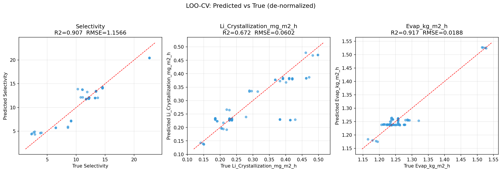

### 2b. Physical Bounds Check

| Target | Min | Max | Mean | Negative Count |
|--------|-----|-----|------|---------------|
| Selectivity | 4.3604 | 20.4769 | 11.6563 | 0 |
| Li_Crystallization_mg_m2_h | 0.1375 | 0.4784 | 0.2802 | 0 |
| Evap_kg_m2_h | 1.1751 | 1.5271 | 1.2574 | 0 |

### 2c. Baseline Comparison

| Method | Target | MAE | RMSE | R2 |
|--------|--------|-----|------|-----|
| MAE+Head | Selectivity | 0.7636 | 1.1566 | 0.9065 |
| MAE+Head | Li_Crystallization_mg_m2_h | 0.0373 | 0.0602 | 0.6720 |
| MAE+Head | Evap_kg_m2_h | 0.0138 | 0.0188 | 0.9166 |
| Mean | Selectivity | 2.3662 | 3.8315 | -0.0258 |
| Mean | Li_Crystallization_mg_m2_h | 0.0978 | 0.1064 | -0.0258 |
| Mean | Evap_kg_m2_h | 0.0338 | 0.0661 | -0.0258 |
| Linear | Selectivity | 0.8630 | 1.3902 | 0.8650 |
| Linear | Li_Crystallization_mg_m2_h | 0.0820 | 0.0900 | 0.2665 |
| Linear | Evap_kg_m2_h | 0.0279 | 0.0411 | 0.6031 |

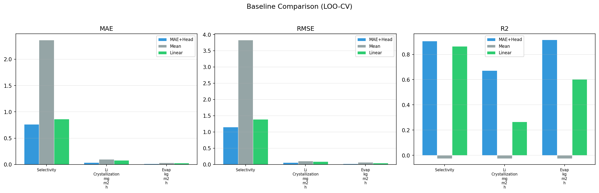

