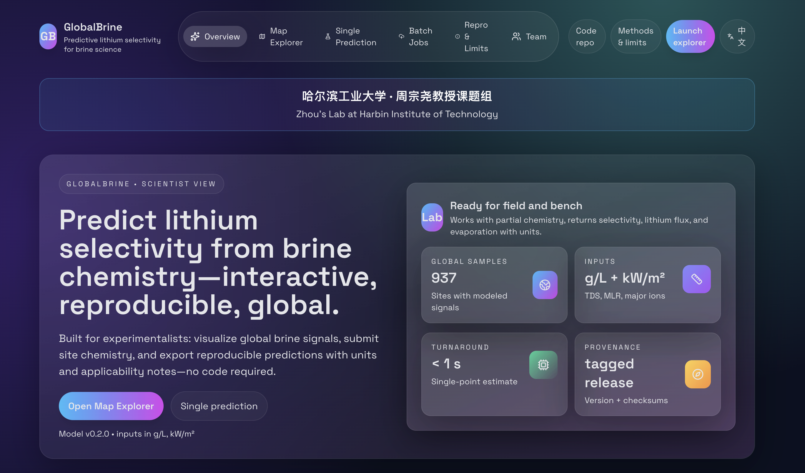

# GlobalBrine Web Platform

End-to-end web experience for the GlobalBrine-LithiumModel: FastAPI backend + React/Tailwind frontend + MapLibre explorer.

## Version

- Web UI: **v0.3.0** — April 6, 2026
- Backend/API: aligned to model artifacts `models/mae_pretrained.pth` + `models/downstream_head.pth`
- Key endpoints: `/api/v1/model`, `/api/v1/data/points`, `/api/v1/predict`, `/api/v1/predict/batch`
- Theme: dark glassmorphism, MapLibre map layers, CSV batch upload with in-memory job store

## Quick start (local)

```bash
# 1) API (from repo root)
python -m pip install -r requirements.txt
uvicorn web.backend.main:app --reload

# 2) Frontend (new terminal)
cd web/app
npm install
npm run dev
```

The Vite dev server proxies `/api` to `http://localhost:8000`.

## Production

- URL: https://globalbrine.com
- Hosted on Tencent Cloud Lighthouse (Singapore, 2C4G)
- HTTPS via Let's Encrypt (auto-renew)

Homepage preview:



## Environment switches

- `GLB_MODEL_VERSION` (default `0.3.0`)
- `GLB_MAE_PATH`, `GLB_HEAD_PATH`, `GLB_SCALER_PATH` (defaults to `models/` and `data/processed/feature_scaler.joblib`)
- `GLB_PREDICTIONS_CSV` (defaults to `data/predictions/brines_with_predictions.csv`; auto-generated if missing)
- `GLB_JOB_STORAGE_DIR` (defaults to `web/backend/jobs`)
- `GLB_ALLOW_ORIGINS` (comma list)

## API surface

- `GET /api/v1/model` — model metadata, git tag/commit, checksums
- `GET /api/v1/data/points` — GeoJSON of brine points + summary stats
- `POST /api/v1/predict` — single-point JSON prediction (partial inputs OK)
- `POST /api/v1/predict/batch` — CSV upload → async job
- `GET /api/v1/predict/batch/{job_id}/status|result`

## Frontend routes

- `/` landing dashboard
- `/map` global explorer (MapLibre)
- `/predict` single-point form
- `/batch` async upload + polling
- `/model` reproducibility + checksums

## Notes

- Batch jobs persist under `web/backend/jobs/` for 48h by default.
- Geo endpoint falls back to running `src/models/predict_brines.py` if the predictions CSV is missing.

## Deploy (Docker Compose on any Linux server)

Deployment files are in `deploy/`:

```bash
# On the server:
git clone https://github.com/JiahaoZhang-Public/GlobalBrine-LithiumModel.git /opt/globalbrine
cd /opt/globalbrine

# Build frontend
cd web/app && npm ci && npm run build && cd ../..

# Start services
cd deploy && docker compose up -d --build
```

**Architecture**:
- `globalbrine-api`: FastAPI + PyTorch (CPU) in Docker, port 8000 (internal)
- `globalbrine-nginx`: Nginx reverse proxy, serves frontend SPA + proxies `/api` to backend

**HTTPS (Let's Encrypt)**:
```bash
sudo certbot certonly --standalone -d globalbrine.com --agree-tos --email your@email.com
# Certs are mounted into nginx container via /etc/letsencrypt volume
```

**Verify**:
- `GET /api/v1/model` → 200 JSON
- `GET /api/v1/data/points` → GeoJSON
- UI routes `/`, `/map`, `/predict`, `/batch`, `/model` load (SPA fallback on)
- `POST /api/v1/predict` returns predictions
